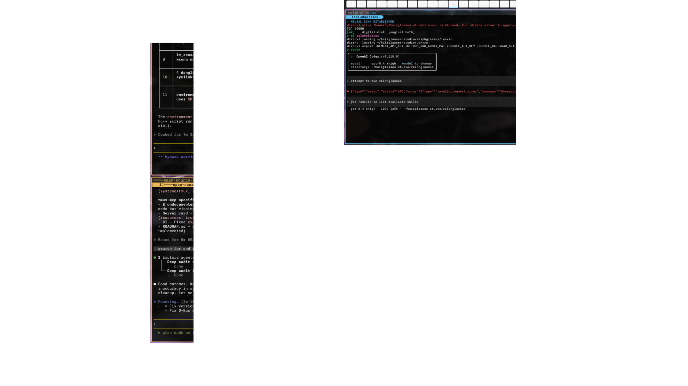

# dotfiles

[](https://opensource.org/licenses/MIT)
[](kitty/shaders/)
[](mcp/)
[](https://hyprland.org/)
[](https://github.com/hairglasses-studio/dotfiles/actions/workflows/ci.yml)
[](https://github.com/hairglasses-studio/dotfiles/actions/workflows/ci-go-mcp.yml)
[](https://github.com/hairglasses-studio/dotfiles/actions/workflows/ci-lint.yml)
[](https://securityscorecards.dev/viewer/?uri=github.com/hairglasses-studio/dotfiles)

Full-stack development environment for Manjaro Linux. Combines a wallpaper-aware `Voltage After Dark` shell theme, Kitty-native visual rotation, declarative package management, and **1,400+ MCP tools** for desktop automation, fleet management, and AI agent infrastructure.



### Technical Highlights

- **GPU Shaders**: 131 CRTty-ready GLSL shaders paired with Kitty theme playlists for per-spawn visual rotation
- **Theme System**: shared token pipeline for `eww`, `hyprshell`, `swaync`, `wofi`, and `wlogout`, with optional wallpaper-derived accent overlays via `theme-sync`
- **MCP Servers**: 1,400+ tools across 7 Go + 3 JS modules — desktop control, Bluetooth/MIDI, Kitty visual pipeline, GitHub org lifecycle, fleet auditing ([dotfiles-mcp](https://github.com/hairglasses-studio/dotfiles-mcp))
- **GitHub Stars Workflow**: taxonomy audit, GitHub list management, and Codex MCP install helpers via `scripts/hg-github-stars.sh`
- **Desktop Automation**: 19 Hyprland IPC tools, atomic config writes, compositor abstraction layer
- **Package Management**: Declarative metapac with 12 groups (paru backend)
- **Shell Framework**: Shared libraries for CLI utilities, notifications, config management

The managed workstation alias `studio_desktop` now projects the desktop-focused `dotfiles-mcp` profile into Codex, Claude, and Gemini through the existing home-sync path.

Hyprland + eww + hyprshell + hypr-dock + swaync + kitty + Starship + Oh My Zsh + Neovim + tmux + btop + yazi + cava + lazygit.

## Install

```bash
git clone git@github.com:hairglasses-studio/dotfiles.git ~/hairglasses-studio/dotfiles
cd ~/hairglasses-studio/dotfiles
bash install.sh
```

The installer is idempotent — safe to run multiple times. Existing files are backed up to `~/.dotfiles-backup-*/`.

### What the installer does

1. Installs paru + metapac (declarative package management, 12 groups)
2. Installs Oh My Zsh + 5 community plugins + Powerlevel10k theme
3. Bootstraps lazy.nvim for Neovim
4. Installs TPM (Tmux Plugin Manager)
5. Symlinks all 60+ configs to their expected locations
6. Links managed `~/.local/bin` wrappers for Kitty, launcher fallback, app switcher, and the canonical Codex/Claude/Gemini launchers on Linux
7. Enables repo-managed systemd user services and packaged system services where applicable
8. Syncs the shared shell theme into writable config targets and bootstraps Hyprland plugins via `hyprpm`
9. Builds bat theme cache

### Post-install

```bash
# Validate all symlinks
bash install.sh --check

# Install Neovim plugins (lazy.nvim auto-installs on first launch)
nvim --headless "+Lazy! sync" +qa

# Install tmux plugins — open tmux, press C-a then Shift-I
tmux new-session

# Sync the shared shell theme and Hyprland plugins
theme-sync
hyprpm-bootstrap
```

### Machine-specific config

- `hyprland/monitors.conf` — per-machine monitor layout and workspace orientation
- `hyprland/local.conf` — per-machine overrides (intentionally sparse)
- `git/gitconfig` — name, email
- `ssh/config` — 1Password SSH agent path

## What's Inside

| Config | Description |
|--------|-------------|
| `hyprland/` | Tiling WM — 113 keybinds, custom animations, plugin-based layout, wallpaper mode orchestration |
| `eww/` | Status bar widgets, calendar, sidebar, powermenu, dashboard |
| `hyprshell/` | Primary launcher, overview, and app switcher for `Super+D` / `Alt+Tab` |
| `hypr-dock/` | Bottom dock with pinned apps, indicators, and window previews |
| `hyprdynamicmonitors/` | Dynamic monitor profiles that generate Hyprland includes into state storage |
| `hyprland-autoname-workspaces/` | Workspace naming and icon rules for cleaner shell surfaces |
| `swaync/` | Notification center + control surface themed from the shared token pipeline |
| `wofi/` | Responsive fallback launcher/switcher styling and emoji picker |
| `wlogout/` | Power menu overlay aligned with the shell token system |
| `kitty/` | GPU terminal write target with CRTty shaders, theme playlists, shuffled visuals, and watcher-driven retheming |
| `ghostty/` | State-aware companion terminal config and shader compatibility surface for the shared desktop pipeline |
| `foot/` | Lightweight terminal (dropdown/fallback) |
| `zsh/` | Oh My Zsh, Starship prompt, 650+ aliases |
| `starship/` | Fill-based right alignment, git metrics, cloud context |
| `nvim/` | lazy.nvim, treesitter, LSP, telescope, Snazzy theme |
| `btop/` | System monitor with Snazzy theme |
| `yazi/` | Terminal file manager with Snazzy theme |
| `cava/` | Audio visualizer — 8-color Snazzy gradient |
| `k9s/` | Kubernetes TUI with Snazzy skin, 7 plugins, 18 aliases |
| `tmux/` | TPM, 7 plugins, vim-tmux-navigator, Snazzy status bar |
| `lazygit/` | Git TUI with Snazzy theme |
| `bat/` | Cat replacement with Snazzy syntax theme |
| `makima/` | Gamepad-to-keyboard remapper with per-app profiles |
| `juhradial/` | Seed `config.json` + `profiles.json` for MX Master 4 via juhradial-mx |
| `metapac/` | Declarative package management — 12 groups, paru backend |
| `topgrade/` | System update orchestration |
| `pypr/` | Hyprland scratchpads (terminal, volume, files) |
| `systemd/` | Repo-managed user services; Makima remains a packaged system service |

### Directory layout

```
dotfiles/
├── hyprland/       → ~/.config/hypr (WM + hypridle + hyprlock + pyprland)
├── hyprshell/      → ~/.config/hyprshell (launcher + overview)
├── hypr-dock/      → ~/.config/hypr-dock (dock + theme)
├── hyprdynamicmonitors/ → ~/.config/hyprdynamicmonitors (dynamic monitor profiles)
├── hyprland-autoname-workspaces/ → ~/.config/hyprland-autoname-workspaces
├── eww/            → ~/.config/eww (bar + widgets)
├── kitty/          → ~/.config/kitty (terminal + 131 shaders)
├── swaync/         → ~/.config/swaync (notifications)
├── wofi/           → ~/.config/wofi (fallback launcher)
├── wlogout/        → ~/.config/wlogout (power menu)
├── foot/           → ~/.config/foot (fallback terminal)
├── nvim/           → ~/.config/nvim (editor)
├── bat/            → ~/.config/bat (cat replacement)
├── btop/           → ~/.config/btop (system monitor)
├── cava/           → ~/.config/cava (audio visualizer)
├── yazi/           → ~/.config/yazi (file manager)
├── k9s/            → ~/.config/k9s (kubernetes)
├── lazygit/        → ~/.config/lazygit (git TUI)
├── juhradial/      → copied to ~/.config/juhradial (MX Master 4 seed config)
├── makima/         → ~/.config/makima (gamepad mapping)
├── pypr/           → ~/.config/pypr (scratchpads)
├── metapac/        → ~/.config/metapac (package groups)
├── topgrade/       → ~/.config/topgrade (system updates)
├── systemd/        → ~/.config/systemd/user/ (repo-managed user services; Makima stays system-scoped)
├── zsh/            → ~/.zshrc + ~/.zshenv + ~/.p10k.zsh
├── git/            → ~/.gitconfig + ~/.config/delta + ~/.config/git/ignore
├── tmux/           → ~/.tmux.conf
├── starship/       → ~/.config/starship.toml
├── scripts/        → 40+ utility scripts (selected launchers are linked into ~/.local/bin)
├── Pacfile         → fallback package list
├── install.sh      → symlink installer
└── Pacfile         → fallback package list for bootstrap installs
```

## MCP Servers

All MCP tools are consolidated under `mcp/` (7 Go modules + 3 JS servers via `go.work`). Total: **1,400+ tools**.

| Server | Tools | Description |
|--------|-------|-------------|
| `dotfiles-mcp` | 100+ | Desktop config management, Hyprland control, GitHub Stars taxonomy, Kitty visual pipeline, input devices |
| `hg-mcp` | 200+ | SDLC ops, fleet management, repo analysis, prompt pipeline |
| `systemd-mcp` | 10 | Systemd unit management |
| `tmux-mcp` | 11 | Tmux session management |
| `process-mcp` | 8 | Process debugging and port investigation |
| `mapitall` | 30+ | Controller/MIDI mapping engine |
| `mapping` | 20+ | Input mapping profiles |

All servers are built on [mcpkit](https://github.com/hairglasses-studio/mcpkit) and use stdio transport.
Mirror-managed MCP modules and the repo-local parity checker are documented in [docs/MCP-MIRROR-PARITY.md](docs/MCP-MIRROR-PARITY.md).

Mirrored MCP modules and the parity contract are tracked in [docs/MCP-MIRROR-PARITY.md](docs/MCP-MIRROR-PARITY.md).

## Troubleshooting

**Shaders don't animate:** Check shader configuration in kitty config and verify CRTty/Hypr-DarkWindow transpilation.

**Powerlevel10k prompt looks broken:** Ensure `Maple Mono NF CN` is installed for shell UI and `Monaspace` is installed for terminal surfaces.

**Symlinks point to wrong place:** Run `bash install.sh --check` to validate.

**tmux plugins not loading:** Inside tmux, press `C-a` then `shift-I` to trigger TPM install.

**Hyprland plugins not working:** Re-run the repo-managed bootstrap:
```bash
hyprpm-bootstrap
```

## Font

[Maple Mono NF CN](https://github.com/subframe7536/maple-font) drives shell UI and window chrome. [Monaspace](https://monaspace.githubnext.com/) drives terminal/code surfaces. Install via `sudo pacman -S maplemono-nf-cn otf-monaspace otf-monaspace-nerd`.

## License

MIT
